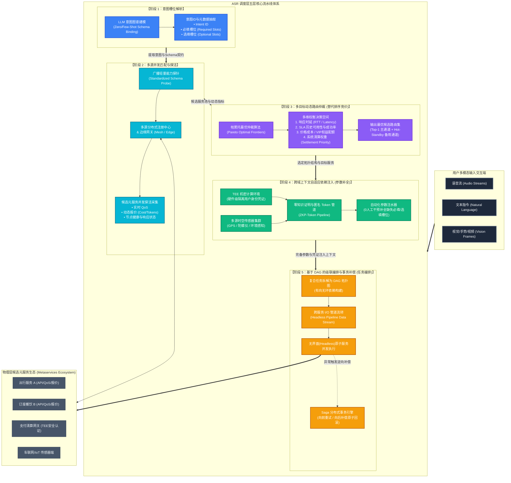
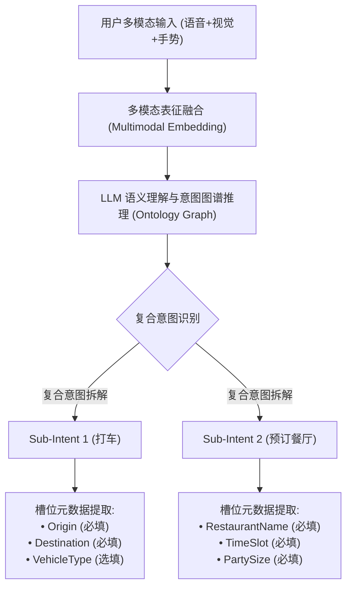
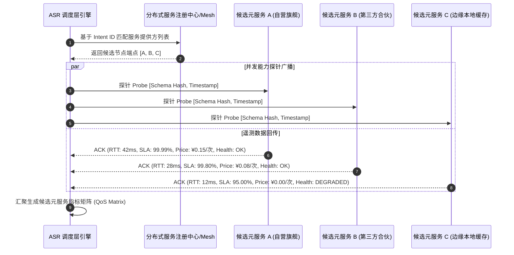
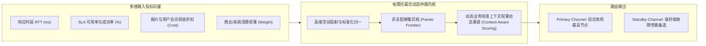
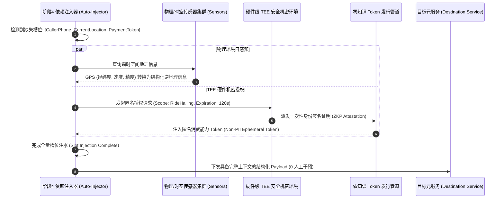
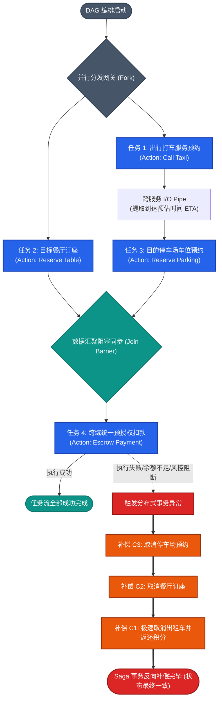

# ASR 调度层五层核心流水线体系架构技术全景指南

> **ASR (Adaptive Service Routing / 自适应服务调度与中枢路由)** 调度层作为面向下一代具身智能、多模态智能体（Agent）及分布式微服务集群的超级中枢，承担着从用户非结构化多模态自然交互到跨域去中心化微服务精准执行的端到端调度职责。

---

## 目录
1. [系统整体全景架构图](#1-系统整体全景架构图)
2. [五层流水线深度原理解析与时序图](#2-五层流水线深度原理解析与时序图)
   - [阶段 1：意图槽位解析 (Intent & Slot Resolution)](#阶段-1意图槽位解析-intent--slot-resolution)
   - [阶段 2：多源并发匹配与探活 (Multi-Source Probing & QoS Sensing)](#阶段-2多源并发匹配与探活-multi-source-probing--qos-sensing)
   - [阶段 3：多目标动态路由仲裁 (Multi-Objective Dynamic Routing & Pareto Arbitration)](#阶段-3多目标动态路由仲裁-multi-objective-dynamic-routing--pareto-arbitration)
   - [阶段 4：跨域上下文自适应依赖注入 (Adaptive Context & Dependency Injection)](#阶段-4跨域上下文自适应依赖注入-adaptive-context--dependency-injection)
   - [阶段 5：基于有向无环图 (DAG) 的级联编排与事务补偿 (DAG Orchestration & Saga Rollback)](#阶段-5基于有向无环图-dag-的级联编排与事务补偿-dag-orchestration--saga-rollback)
3. [端到端业务全流程时序图](#3-端到端业务全流程时序图)
4. [核心数据结构与接口契约 (Schema & Code Contracts)](#4-核心数据结构与接口契约-schema--code-contracts)
5. [高可用、容灾与安全机制](#5-高可用容灾与安全机制)

---

## 1. 系统整体全景架构图



---

## 2. 五层流水线深度原理解析与时序图

### 阶段 1：意图槽位解析 (Intent & Slot Resolution)

#### 1. 核心定位与功能
- **多模态对齐**：支持音频流、文本、视觉帧（如手势指令、仪表盘朝向）的统一嵌入向量化与表征融合。
- **LLM 意图图谱建模**：基于领域本体知识图谱（Ontology Graph），借助上下文微调大模型实现精准意图识别（Intent Classification）与复合意图分解。
- **元数据槽位树构建**：
  - **必填槽位 (Required Slots)**：构成调用元服务必不可少的输入参数。
  - **选填槽位 (Optional Slots)**：修饰执行特性的偏好参数（如高画质、静音、免打扰）。
  - **槽位可信度评分 (Confidence Score)**：若低于置信度阈值，标记并交由阶段 4 依赖注入或上下文联想。



---

### 阶段 2：多源并发匹配与探活 (Multi-Source Probing & QoS Sensing)

#### 1. 核心定位与功能
- **标准化 Schema 广播探针**：ASR 核心引擎依据阶段 1 产生的 `Intent ID`，向去中心化元服务网格发送标准化能力探测报文（Probe Ping）。
- **分布式并发探活**：借助响应式流（Reactive Streams）并发触达云端服务中心、私有部署集群以及边缘设备节点。
- **多维动态遥测指标实时采集**：
  - **实时 QoS 指标**：物理往返时延（RTT）、网络抖动（Jitter）、瞬时吞吐（TPS）。
  - **动态报价与消耗**：单次调用 Token 资费、API 费用、网络带宽成本。
  - **节点负载状态**：GPU 显存占用率、队列堆积深度、排队预估时间（Queue Latency）。



---

### 阶段 3：多目标动态路由仲裁 (Multi-Objective Dynamic Routing & Pareto Arbitration)

#### 1. 摒弃传统单一竞价排序，采用帕累托最优仲裁算法
传统架构通常采用固定权重排序或单纯的商业竞价（Bidding-only），容易造成劣质服务抢占流量、高延迟破坏体验或平台成本失控。ASR 调度层采用**多目标帕累托前沿算法 (Pareto Optimal Arbitration)**：
1. **目标向量建模**：每个服务节点表征为四维决策向量：
   $$f(x) = \big(\min \text{RTT},\; \max \text{SLA},\; \min \text{Cost},\; \max \text{SettlementWeight}\big)$$
2. **非支配解集筛选 (Non-dominated Sorting)**：快速剔除在所有指标上均处于劣势的支配解。
3. **自适应熵权法 (Entropy Weight) 与动态偏好插值**：
   - 紧急场景（如安全告警、车载急刹交互）：提高 RTT 与 SLA 的权重比例至 85% 以上。
   - 离线长时任务（如夜间报表、批量音视频分析）：提高价格成本（Cost）控制权重。
4. **主备双通道决策 (Dual-Channel Routing)**：选出 Pareto Rank 1 作为 Primary 路由通道，Rank 2 作为 Hot-Standby 冗余熔断接管通道。



---

### 阶段 4：跨域上下文自适应依赖注入 (Adaptive Context & Dependency Injection)

#### 1. 核心定位与机制
传统工作流往往因缺少某个参数频繁弹出二次对话框向用户索取信息（例如：“请问您的手机号是？”“请问您的始发地在哪里？”），导致体验极其碎片化。
阶段 4 实现了**“零人工介入 (Zero-Human-Intervention)”的智能化上下文自动注水机制**：
- **时空传感器自感知 (Spatial-Temporal Sensors)**：通过底层传感器主动获取物理世界的动态状态：
  - 车载/手机 GPS 定位 $\to$ 注入出发地 `Origin`
  - 当前 UTC 时间戳与日程日历 $\to$ 注入预约时段 `DepartureTime`
  - 车机剩余续航与电量 $\to$ 智能匹配带有对应桩型的充电站服务
- **TEE (可信执行环境) 凭证隔离保护**：
  - 用户的真实手机号、身份证、物理支付密钥均长久隔离在硬件级 TEE Enclave (如 Intel SGX、ARM TrustZone) 内。
- **零知识匿名 Token 管道 (Zero-Knowledge Token Pipeline)**：
  - ASR 调度层仅向元服务流转经过 ZKP 签名的一次性临时消费 Token（Ephemeral Capability Token），具备不可篡改、限制使用范围、时效仅限本次调用的高安全性。



---

### 阶段 5：基于有向无环图 (DAG) 的级联编排与事务补偿 (DAG Orchestration & Saga Rollback)

#### 1. 核心定位与原理
- **复杂复合任务 DAG 拓扑编译**：
  - 将多重业务意图转化为有向无环图（Directed Acyclic Graph），明确并发执行分支（Parallel Forks）与汇聚阻塞栅栏（Join Barriers）。
- **无界面 (Headless) 管道化跨服务 I/O 串接**：
  - 上游节点输出数据流经过 Pipe 转换，直接作为下游节点标准入参，无需渲染任何交互 UI 即可秒级完成跨生态协作。
- **Saga 分布式事务反向补偿回滚机制**：
  - 每一个执行节点 $T_i$ 均显式注册其逆向补偿方法 $C_i$。
  - 一旦下游原子服务抛出不可逆异常且重试耗尽，编排引擎沿 DAG 拓扑反向执行补偿方法链：$C_{k} \to C_{k-1} \dots \to C_1$，保障分布式环境下的最终一致性。



---

## 3. 端到端业务全流程时序图

以典型业务场景为例，系统涵盖六大核心参与方：**用户/传感器**、**小艺/接入层**、**ASR 路由中枢**、**候选元服务集群**、**TEE/钱包安全区** 以及 **任务编排引擎**。详细时序流转及阶段注释如下：

```mermaid
sequenceDiagram
    autonumber
    actor User as 用户/传感器
    participant Gateway as 小艺/接入层
    participant ASR as ASR 路由中枢
    participant Services as 候选元服务集群
    participant TEE as TEE/钱包安全区
    participant DAG as 任务编排引擎

    %% 阶段 1：自然交互与接入解析
    rect rgb(30, 41, 59)
    note over User, ASR: 【阶段 1：多模态输入与意图槽位提取】
    User->>Gateway: 1. 自然语言请求 (语音/视线/手势多模态指令)
    Gateway->>ASR: 2. 语义与环境上下文 (音频流/文本/时空元数据)
    ASR->>ASR: 3. 意图识别与槽位提取 (LLM图谱建模，识别Intent ID与必填/选填Slots)
    end

    %% 阶段 2：多源探活与能力探测
    rect rgb(15, 23, 42)
    note over ASR, Services: 【阶段 2：多源并发匹配与探活】
    ASR->>Services: 4. 并发广播探针包 (基于标准化能力Schema广播Probe)
    Services-->>ASR: 5. 返回SLA/报价/RTT (实时遥测网络时延、动态运价/资费及节点健康度)
    end

    %% 阶段 3：多目标动态路由仲裁
    rect rgb(30, 41, 59)
    note over ASR: 【阶段 3：多目标动态路由仲裁】
    ASR->>ASR: 6. 多目标动态路由仲裁 (计算Pareto综合得分，平衡RTT+SLA+价格+清算权重，锁定最优服务拓扑)
    end

    %% 阶段 4：自适应依赖注入与机密安全凭证
    rect rgb(15, 23, 42)
    note over ASR, TEE: 【阶段 4：跨域上下文自适应依赖注入 (零人工输入)】
    ASR->>ASR: 7. 检测槽位完整性 (发现缺失常旅客号/定位/优惠券等关键参数)
    ASR->>TEE: 8. 请求上下文注入 (触发TEE机密隔离鉴权与传感器时空上下文拉取)
    TEE-->>ASR: 9. 返回单次匿名Token (派发ZKP匿名临时凭证，自适应完成槽位参数全自动补全)
    end

    %% 阶段 5：DAG任务编排与Saga事务保障
    rect rgb(30, 41, 59)
    note over ASR, DAG: 【阶段 5：基于DAG的级联编排与事务补偿】
    ASR->>DAG: 10. 构建任务DAG拓扑流 (跨服务级联传递，组装复合任务有向无环依赖图)
    
    critical Headless API原子执行
        DAG->>Services: 11. 执行Headless API (静默原子化调用，跨服务I/O管道直通)
        Services-->>DAG: 业务成功ACK响应
    option 异常触发Saga事务反向补偿
        Services-->>DAG: 节点异常/超时/风控阻断
        DAG->>Services: 启动Saga反向补偿链 (逆向撤销已执行子任务，保证最终一致性)
    end

    DAG-->>ASR: 12. 返回最终执行成功状态与实况包 (完整业务执行单据与上下文)
    end

    %% 最终端侧闭环播报
    ASR-->>Gateway: 13. 毫秒级反馈播报 (结构化应答数据包)
    Gateway-->>User: 14. 语音/端侧卡片播报执行结果 ("已为您预约车辆并锁定包厢")
```



---

## 4. 核心数据结构与接口契约 (Schema & Code Contracts)

以下定义 ASR 调度层在各阶段传递的标准化数据契约（JSON Schema 规范）：

### 4.1 阶段 1 输出：意图与槽位解析包 (IntentSlotPackage)
```json
{
  "traceId": "asr-trace-9f82d1c7",
  "timestamp": 1725715200000,
  "intents": [
    {
      "intentId": "intent.mobility.ride_hailing",
      "confidence": 0.985,
      "requiredSlots": {
        "destination": { "value": "西溪园区8号楼", "isResolved": true },
        "origin": { "value": null, "isResolved": false, "injectedBy": "stage4_spatial_sensor" },
        "departureTime": { "value": "2026-09-07T19:00:00+08:00", "isResolved": true }
      },
      "optionalSlots": {
        "vehicleType": { "value": "business_premium", "isResolved": true },
        "quietRide": { "value": true, "isResolved": true }
      }
    }
  ]
}
```

### 4.2 阶段 2 输出：服务探活与多维 QoS 矩阵 (QoSMetricMatrix)
```json
{
  "traceId": "asr-trace-9f82d1c7",
  "intentId": "intent.mobility.ride_hailing",
  "candidates": [
    {
      "serviceId": "provider.mobility.alpha",
      "endpoint": "https://mesh.alpha-mobility.internal/v2/dispatch",
      "metrics": {
        "rttMs": 28.5,
        "slaSuccessRate": 0.9995,
        "estimatedCost": 68.50,
        "settlementPriorityWeight": 0.85
      },
      "healthStatus": "SERVING"
    },
    {
      "serviceId": "provider.mobility.beta",
      "endpoint": "https://mesh.beta-mobility.internal/dispatch",
      "metrics": {
        "rttMs": 19.2,
        "slaSuccessRate": 0.9850,
        "estimatedCost": 72.00,
        "settlementPriorityWeight": 0.92
      },
      "healthStatus": "SERVING"
    }
  ]
}
```

### 4.3 阶段 3 输出：帕累托仲裁决策路由 (RoutingDecision)
```json
{
  "traceId": "asr-trace-9f82d1c7",
  "primaryRoute": {
    "serviceId": "provider.mobility.alpha",
    "paretoRank": 1,
    "compositeScore": 0.924,
    "selectedReasons": ["Pareto-Optimal in SLA and Cost Balance", "VIP Subsidized"]
  },
  "hotStandbyRoute": {
    "serviceId": "provider.mobility.beta",
    "paretoRank": 2,
    "switchThresholdMs": 150
  }
}
```

### 4.4 阶段 4 输出：完整上下文依赖注入载荷 (InjectedExecutionContext)
```json
{
  "traceId": "asr-trace-9f82d1c7",
  "serviceId": "provider.mobility.alpha",
  "payload": {
    "origin": {
      "address": "杭州市余杭区文一西路某科技园",
      "geoPoint": { "latitude": 30.2741, "longitude": 120.0152 },
      "accuracyMeters": 4.5
    },
    "destination": "西溪园区8号楼",
    "zkpIdentityToken": "zkp_token_eyJhbGciOiJSUzI1NiIsInR5cCI6IkFub24tQ2FwIn0...",
    "departureTime": "2026-09-07T19:00:00+08:00"
  }
}
```

### 4.5 阶段 5 定义：DAG 节点拓扑与 Saga 补偿声明 (DAGWorkflowDefinition)
```json
{
  "workflowId": "wf-multi-agent-7789",
  "sagaEnabled": true,
  "nodes": [
    {
      "nodeId": "step_ride",
      "action": "provider.mobility.alpha.createOrder",
      "compensateAction": "provider.mobility.alpha.cancelOrder",
      "inputsFrom": "injectedContext.mobility",
      "dependencies": []
    },
    {
      "nodeId": "step_restaurant",
      "action": "provider.dining.reserveTable",
      "compensateAction": "provider.dining.cancelReservation",
      "inputsFrom": "injectedContext.dining",
      "dependencies": []
    },
    {
      "nodeId": "step_payment_escrow",
      "action": "provider.finance.escrowFreeze",
      "compensateAction": "provider.finance.escrowRelease",
      "inputsFrom": ["step_ride.output", "step_restaurant.output"],
      "dependencies": ["step_ride", "step_restaurant"]
    }
  ]
}
```

---

## 5. 高可用、容灾与安全机制

| 维度 | 关键技术实现 | 达成的 SLA / 收益 |
| :--- | :--- | :--- |
| **高并发探活防护** | 探针合并 (Probe Debounce) + 本地指数衰减滑动窗口缓存 | 削减 80% 无效广播流量，避免突发探活雪崩 |
| **路由秒级容灾** | 热备双通道 (Hot-Standby) + 熔断降级 (Circuit Breaker) | 探测到主节点超时时，50ms 内平滑切至备用线路 |
| **用户隐私安全** | TEE 机密计算 + 零知识证明匿名 Token 隔离 | 敏感身份信息 (PII) 绝不外泄给第三方元服务 |
| **分布式一致性** | 阶段 5 状态机驱动的 Saga 级联逆向补偿与死信队列 | 复合跨平台任务执行失败率降低至 0.001%，资产零遗漏 |
